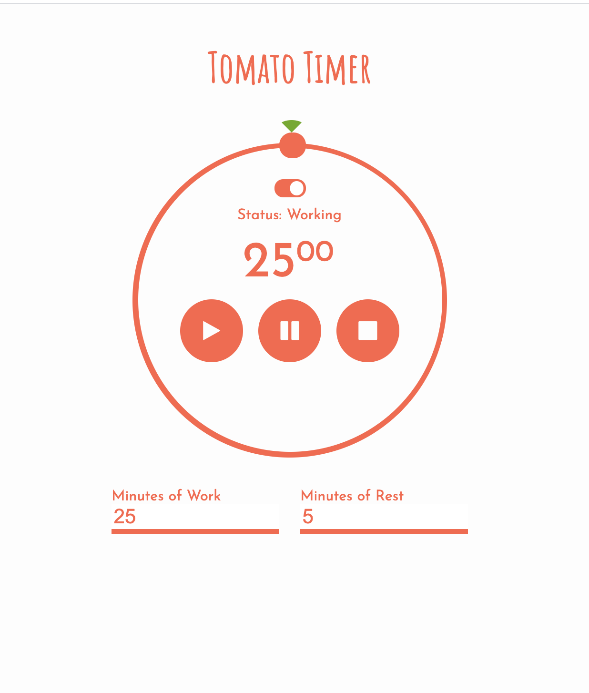

# Pomodoro-Tomato-Timer

This is one of my Full-Stack Coding Bootcamp class activities. I loved how css transformed its look. To help me understand the effect of each line of code in css, I decided to replicate it. 

####  Screenshot
<kbd></kbd>

Bing README Template - Github

## Table of Content
- [Pomodoro-Tomato-Timer](#pomodoro-tomato-timer)
      - [Screenshot](#screenshot)
  - [Table of Content](#table-of-content)
    - [1. Links](#1-links)
      - [Website Link](#website-link)
      - [Work-Files Link](#work-files-link)
    - [2. Project Context - User Story](#2-project-context---user-story)
    - [3. Project Objectives](#3-project-objectives)
    - [4. Outcome](#4-outcome)
    - [5. Screenshots](#5-screenshots)
    - [6. Installation](#6-installation)
    - [7. Credits:](#7-credits)
    - [8. What We've Learned](#8-what-weve-learned)
    - [9. License](#9-license)
        - [MIT License](#mit-license)
#

### 1. Links 

#### Website Link
 https://imbingz.github.io/Pomodoro-Tomato-Timer/

#### Work-Files Link
https://github.com/imbingz/Pomodoro-Tomato-Timer

### 2. Project Context - User Story
AS A Student 
I WANT to manage my time more efficiently using Pomodoro Technique . 
I WANT to be able to set my work and break time. 
SO THAT I can focus on one task at a time without interruption and take regular break. 

### 3. Project Objectives
* 

* It will also feature a clean and polished user interface and be responsive, ensuring that it adapts to multiple screen sizes.

### 4. Outcome
* The user interface is responsive to different devices - mobile, tablets, laptops and larger screen desktops
* The app is dynamic and functional with user search parameters. 
<!-- * Utilized Local Storage to save user search histories.  -->

### 5. Screenshots 

<kbd></kbd>

### 6. Installation
* Access to GitHub.com and a code editor such as vscode is necessary
* Go to [github.com/imbingz/imbingz.github.io.](https://github.com/imbingz/Ultimate-Streaming-Guide)
* Click on the green button that says Clone or Download
* Choose how you would like to download: using the SSH/HTTPS keys or download the zip file
* Using SSH/HTTPS Key: You will copy the link shown and open up either terminal (mac: pre-installed) or gitbash (pc: must be installed). Once the application is open, you will type git clone paste url here. Once you have cloned the git repo, cd into the repo and type open. to open the folder which contains all files used for the website. Once inside the folder, click on index.html to open the website in the browser.
* Using Download ZIP: Click on Download Zip. Locate the file and double click it to unzip the file. Locate the unzipped folder and open it. All the files for the website will be within this folder. Click on index.html to open the website in the browser.
* If you like to test this App, please click the link [here](https://imbingz.github.io/Ultimate-Streaming-Guide/)

### 7. Credits:
* Trilogy Full-Stack Coding Bootcamp 
* 

### 8. What We've Learned

### 9. License
##### MIT License

Copyright (c) [2020] [bingzhang]

Permission is hereby granted, free of charge, to any person obtaining a copy of this software and associated documentation files (the "Software"), to deal in the Software without restriction, including without limitation the rights to use, copy, modify, merge, publish, distribute, sublicense, and/or sell copies of the Software, and to permit persons to whom the Software is furnished to do so, subject to the following conditions:

The above copyright notice and this permission notice shall be included in all copies or substantial portions of the Software.

THE SOFTWARE IS PROVIDED "AS IS", WITHOUT WARRANTY OF ANY KIND, EXPRESS OR IMPLIED, INCLUDING BUT NOT LIMITED TO THE WARRANTIES OF MERCHANTABILITY, FITNESS FOR A PARTICULAR PURPOSE AND NON-INFRINGEMENT. IN NO EVENT SHALL THE AUTHORS OR COPYRIGHT HOLDERS BE LIABLE FOR ANY CLAIM, DAMAGES OR OTHER LIABILITY, WHETHER IN AN ACTION OF CONTRACT, TORT OR OTHERWISE, ARISING FROM, OUT OF OR IN CONNECTION WITH THE SOFTWARE OR THE USE OR OTHER DEALINGS IN THE SOFTWARE.

September 10, 2020.
